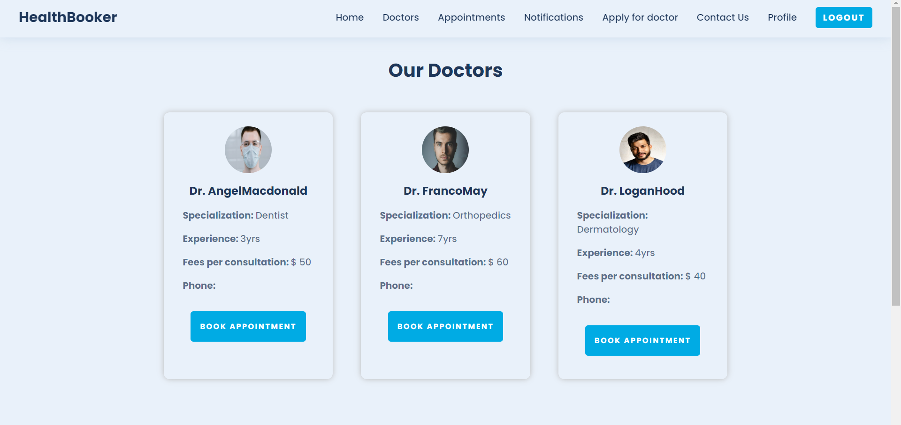
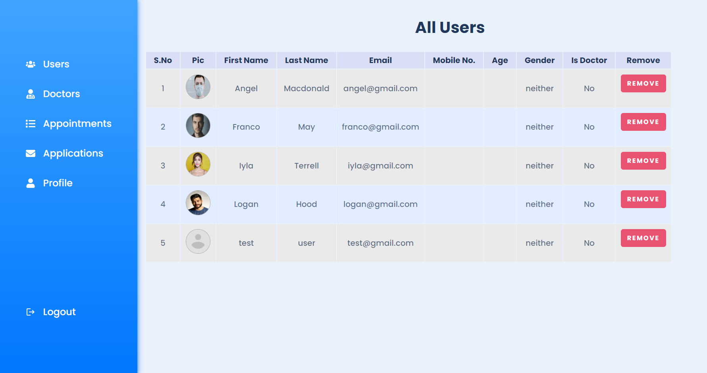
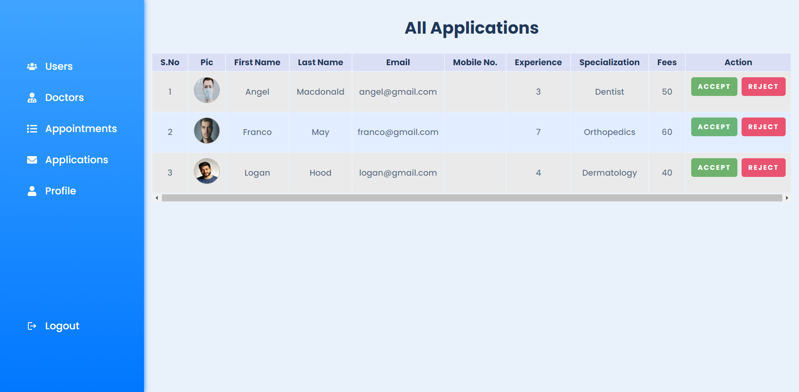
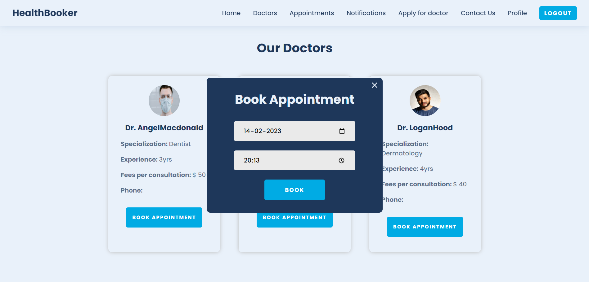

<div id="top"></div>

# 🧑‍⚕️ HealthBooker Project 

---

## 📝 Description

**HealthBooker** is a full-featured healthcare platform that streamlines interaction between doctors and patients. It includes:

- Doctor listing and booking
- Appointment tracking
- Notifications
- Admin approval system
- Secure login and user control

> Built with modern tools for seamless healthcare management.

---

## 🛠️ Built With

<div align="center">


</div>

---

## 📸 Screenshots

| Feature                    | Image                                       |
|----------------------------|---------------------------------------------|
| Home Page                 |   |
| Sign Up Page              |   |
| Sign In Page              |   |
| Profile Page              | |
| All Doctors Page          | |
| Apply as Doctor           |  |
| Admin - All Users         |     |
| Admin - Applications      | |
| Book Appointment          | |
| User Appointments         | |
| Doctor Appointments       | |
| Notifications             | |

---

## 🔐 Features

- ✅ User Registration & Login
- ✅ Doctor Listings & Filters
- ✅ Appointment Booking & Management
- ✅ Notification System
- ✅ Doctor Application Panel
- ✅ Admin Dashboard (users + applications)
- ✅ Secure JWT Auth
- ✅ Role-based Access (User / Doctor / Admin)
- ✅ Form Validation with Formik
- ✅ Cloudinary Image Upload Support

---

## 🚀 Getting Started

### 1. Clone the Repository

```bash
git clone https://github.com/YOUR-USERNAME/YOUR-REPO-NAME.git
cd HealthBooker-main


 2. Install Dependencies

Backend 
```bash
cd server
npm install

Frontend
```bash 
cd ../client
npm install


3. Set Up Environment Variables
Create .env files in both /server and /client folders:

.env (server)
```bash
PORT=5000
MONGO_URI=your_mongodb_uri
JWT_SECRET=your_jwt_secret
CLOUDINARY_CLOUD_NAME=your_cloud_name
CLOUDINARY_API_KEY=your_api_key
CLOUDINARY_API_SECRET=your_api_secret

.env (client)
```bash
REACT_APP_BASE_URL=http://localhost:5000


4. Start the Development Server

Backend
```bash
cd server
npm start

Frontend
```bash
cd client
npm start

Now, visit http://localhost:3000 in your browser.


🧪 Folder Structure

HealthBooker-main/
├── client/         # React frontend
│   ├── src/
│   └── .env
├── server/         # Node.js backend
│   ├── controllers/
│   ├── models/
│   ├── routes/
│   ├── middleware/
│   └── .env
└── README.md

